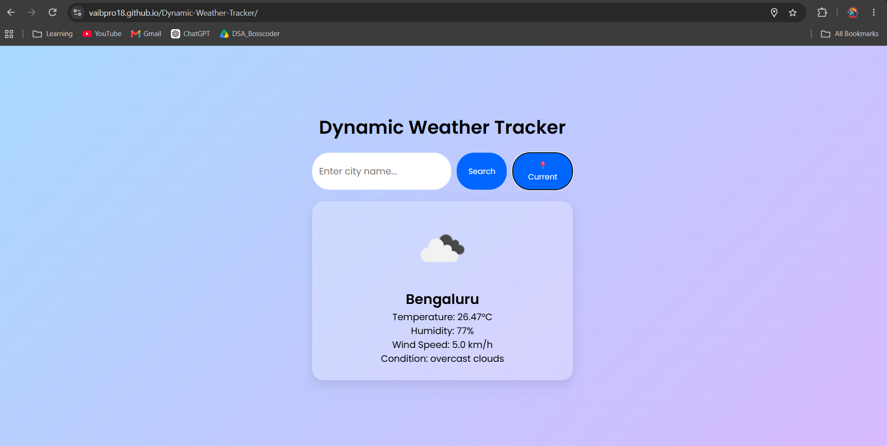

# 🌦️ Dynamic Weather Tracker

A responsive web application that fetches and displays **real-time weather information** for any city or the user's current location using the **OpenWeatherMap API**.

## 📸 Preview


## 🚀 Features

- 🔍 Search weather by city name
- 📍 Get weather using the user's current location through geolocation
- 🌡️ Display current temperature in Celsius
- 💧 Display humidity percentage
- 💨 Display wind speed
- ☁️ Display weather condition and description
- 🌤️ Display weather icons based on current conditions
- ✨ Smooth UI animations and glassmorphism design
- 📱 Responsive design for different screen sizes
- ⚠️ Error handling for invalid cities and unavailable weather data

## 🛠️ Technologies Used

- **HTML5** – Structure and layout
- **CSS3** – Styling, responsive design, animations, and glassmorphism UI
- **JavaScript** – API integration, DOM manipulation, weather data handling, and geolocation
- **OpenWeatherMap API** – Real-time weather data

## 📂 Project Structure

```text
Dynamic-Weather-Tracker/
│
├── index.html       # Main webpage
├── style.css        # Styling and responsive design
├── script.js        # Weather API and application logic
├── README.md        # Project documentation
└── .gitignore       # Ignored local configuration files